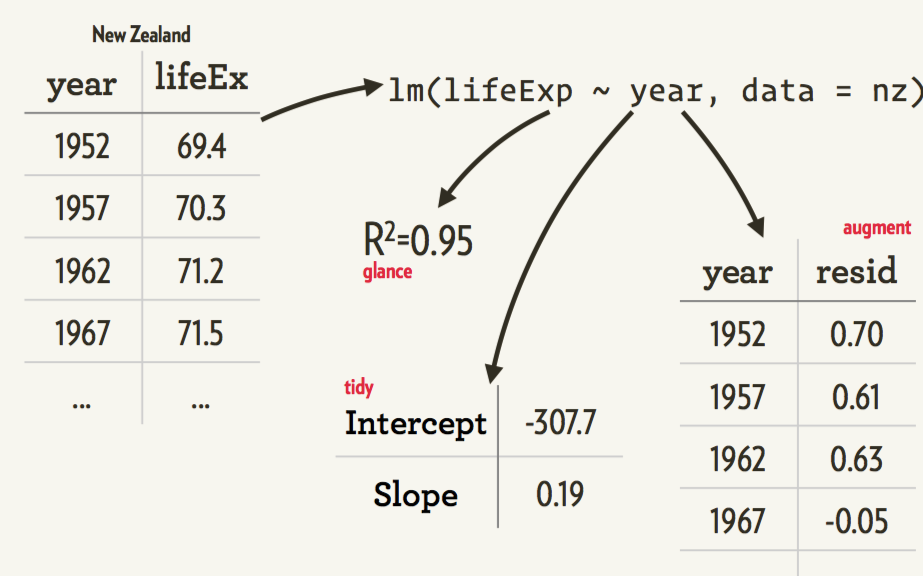
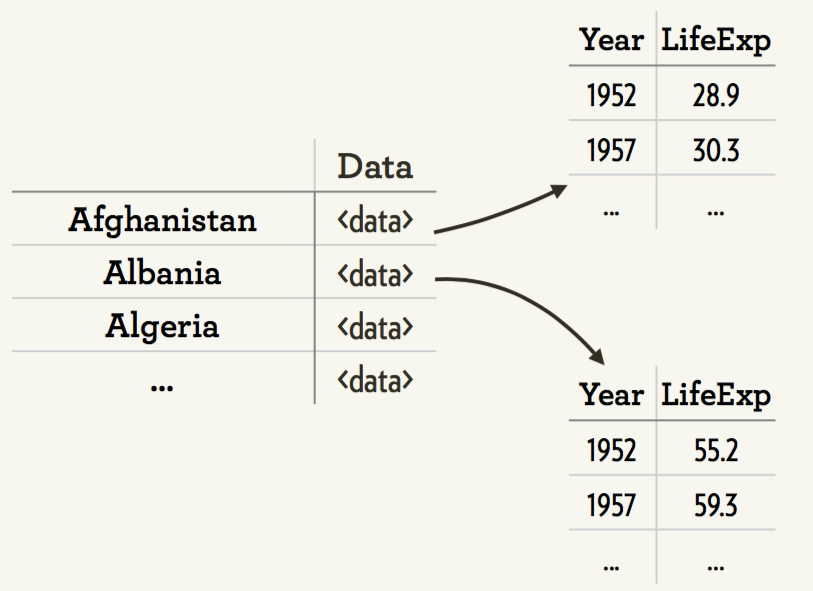
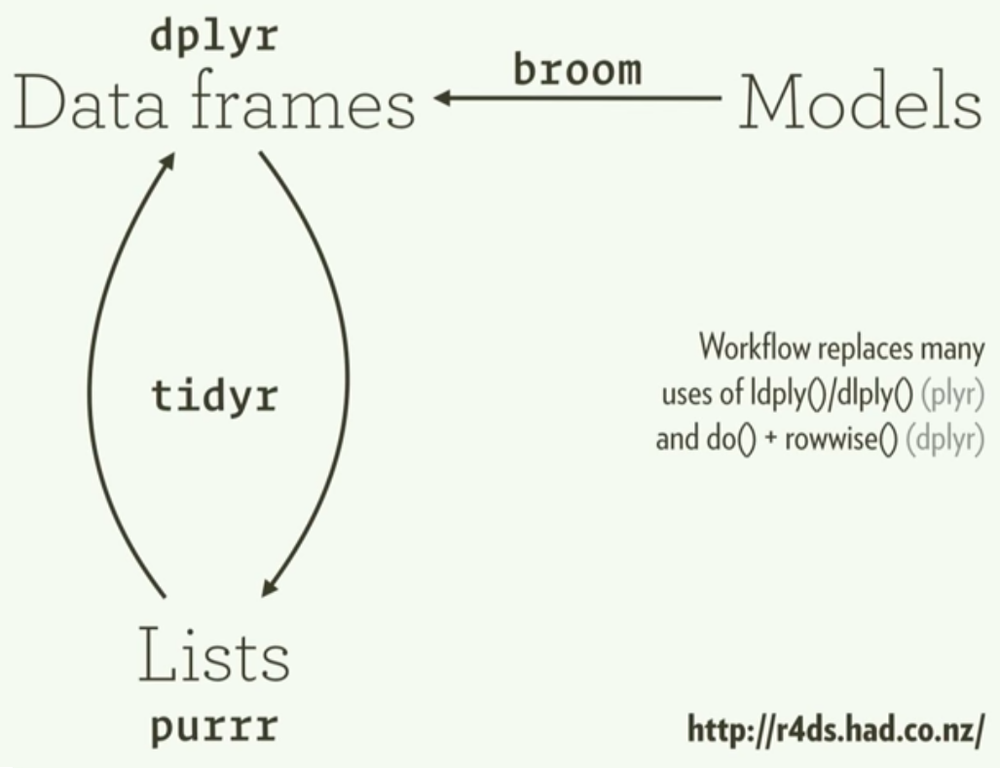

```{r, include=FALSE}
library(knitr)
knitr::opts_chunk$set(warning = FALSE,
                      echo = TRUE,
                      message = FALSE,
                      collapse = FALSE,
                      comment = "#>",
                      fig.align='center',
                      cache=FALSE)
## knitr::opts_knit$set(root.dir = '.')
library(data.table)
library(magrittr)
library(readr)
library(dplyr)
library(tidyr)
library(ggplot2); theme_set(theme_grey()) 
library(gapminder)
library(cowplot)
```


## <br/>視覺化的語言心法—資料、模型、與溝通 {.white}


<p class="white">
`r Sys.Date()`<br/>
</p>
<p style='color:white'>
  呂奕 [Leo Lu](https://github.com/leoluyi)
</p>


## How to use this slides

- Press **Esc** to navigation mode
- Press **pageDown**, **Right** or **Down** to go to next slide
- Presss **PageUP**, **Left** or **Up** to go to previous slide

## 一個例子學會畫圖：mpg 🚗油耗資料

- `mpg` dataset: Fuel economy data from 1999 and 2008 for 38 popular models of car.

| variable     | detail                                               |
|--------------|------------------------------------------------------|
| manufacturer | 車廠                                                 |
| model        | 型號                                                 |
| displ        | 引擎排氣量                                           |
| year         | 出廠年份                                             |
| cyl          | 氣缸數                                               |
| trans        | 自／手排                                             |
| drv          | f = front-wheel drive, r = rear wheel drive, 4 = 4wd |
| cty          | city miles per gallon 城市駕駛油耗                   |
| hwy          | highway miles per gallon 高速公路駕駛油耗            |
| fl           | 汽油: ethanol E85, diesel, regular, premium, CNG     |
| class        | 車型                                                 |


## Aesthetic Mappings

```{r, eval=FALSE}
ggplot(data = <DATA>) + # Data
  geom_<xxx>(
     mapping = aes(<MAPPINGS>), ##  <= Aesthetic mappings
     stat = <STAT>,
     position = <POSITION>
  ) +
  scale_<xxx>() + coord_<xxx>() + facet_<xxx>()
  theme_()
```

## Aesthetics 基本用法

>- x = displ
>- y = hwy
>- color = class

```{r}
ggplot(data = mpg) +
  geom_point(mapping = aes(x = displ, y = hwy, color = class), size = 3)
```

## Aesthetics 基本用法

- x = displ
- y = hwy
- shape = class

```{r}
ggplot(data = mpg) +
  geom_point(mapping = aes(x = displ, y = hwy, shape = class))
```


# ggplot2 威力還不只這些

## Layers 圖層觀念

- 兩層圖層

```{r}
ggplot(data = mpg) +
  geom_point(mapping = aes(x = displ, y = hwy)) +
  geom_smooth(mapping= aes(x = displ, y = hwy))
```


## Too many variables!!!!

- 多了第3個變數，所以更難理解了

```{r, echo=FALSE, fig.asp=0.35, fig.width=10}
p1 <- ggplot(data = mpg) +
  geom_bar(mapping = aes(x = class, fill = manufacturer),
           position = "stack") +
  ggtitle('Position = "stack"')
p2 <- ggplot(data = mpg) +
  geom_bar(mapping = aes(x = class, fill = manufacturer),
           position = "dodge") +
  ggtitle('Position = "dodge"')
cowplot::plot_grid(p1, p2)
```

## Facets: Small-Multiples

- Facets 是很重要的一個呈現方式，一定要學起來
- 為什麼要用 Facets？
    1. 當同一個座標平面塞入太多變數，會造成大腦無法負荷
    2. 分拆資訊，讓大腦協助<underline>腦補</underline>更有效率


```{r facet, fig.width=10, fig.asp=1.4}
ggplot(data = mpg) +
  geom_bar(mapping = aes(x = class)) +
  facet_wrap( ~ manufacturer, ncol = 3)
```

(back to slides)
----------------

# Visualise the model

## The best stats you've ever seen | Hans Rosling { .fullpage }

<a href="https://www.youtube.com/watch?v=hVimVzgtD6w" target="_blank"></a>

## Take a look at our data

```{r}
library(gapminder)
gapminder
```

## Our ggplot

```{r echo=FALSE}
library(gapminder)
ggplot(gapminder, aes(year, lifeExp, group = country)) +
  geom_line() +
  ggtitle("Life expectanty by each country")
```


## Fit a model to each country { .fullpage }



## R packages

1. Nested data (`tidyr`)
2. Functional programming (`purrr`)
3. Models → tidy data (`broom`)

## Split our data into data.frames by group



## Split our data

```{r}
library(dplyr)
library(tidyr)

gapminder <- gapminder %>% mutate(year1950 = year - 1950)
by_country <- gapminder %>% 
  group_by(continent, country) %>% 
  nest

by_country
```

## Fit a model within each country

```{r eval=FALSE}
lm(lifeExp ~ year, data = Afghanistan)
lm(lifeExp ~ year, data = Afghanistan)
...

```

## We can use purrr::map() to fit each model

```{r}
library(purrr)

country_model <- function(df) {
  lm(lifeExp ~ year1950, data = df)
}

models <- by_country %>%
  mutate(mod_lm = map(data, country_model))

models
```

## What can we extract from each model?


## Extract info from model

```{r}
models <- models %>% 
  mutate(
    glance = mod_lm %>% map(broom::glance),
    tidy = mod_lm %>% map(broom::tidy),
    augment = mod_lm %>% map(broom::augment),
    rsq = glance %>% map_dbl("r.squared")
  )
models
```

## See the R^2

```{r seeR2, fig.width=8, fig.asp=2}
models %>% 
  ggplot(aes(rsq, reorder(country, rsq))) +  # use factor levels
  geom_point(aes(colour = continent)) +
  theme(axis.text=element_text(size=rel(0.7)))
```

## Unnest to a regular data frame

```{r}
models %>% unnest(data)
```

## Unnest to a regular data frame

```{r}
models %>% unnest(glance, .drop = TRUE)
```

## Unnest to a regular data frame

```{r}
models %>% unnest(tidy, .drop = TRUE)
```


## Plot the models

```{r}
models %>% 
  unnest(tidy) %>% 
  select(continent, country, term, estimate, rsq) %>% 
  spread(key = term, value = estimate) %>% 
  ggplot(aes(`(Intercept)`, year1950)) +
  geom_point(aes(colour = continent, size = rsq)) +
  geom_smooth(se = FALSE)
```

## Plot the models: augmented

```{r}
models %>% 
  unnest(augment) %>% 
  ggplot(aes(year1950, .resid)) +
  geom_line(aes(group = country), alpha = 0.3) +
  geom_smooth(se = FALSE) +
  geom_hline(yintercept = 0, colour = "red", alpha = 0.7) +
  facet_wrap(~continent)
```

## Quick recap for model viz

Functional programming is very powerful

1. `tidyr`: 把物件 (例如 lm) 用 list 存在 columns 裡面
2. `purrr`: Functional programming
3. `broom`: Models → tidy data

## { .fullpage }



## Reference

- [Hadley Wickham: Managing many models with R](https://www.youtube.com/watch?v=rz3_FDVt9eg)
- [PLOTCON 2016: Hadley Wickham, New open viz in R](https://www.youtube.com/watch?v=cU0-NrUxRw4)
- [Hadley Wickham "Data Science with R"](https://www.youtube.com/watch?v=K-ss_ag2k9E)
- [Cookbook for R](http://www.cookbook-r.com/Graphs/)

