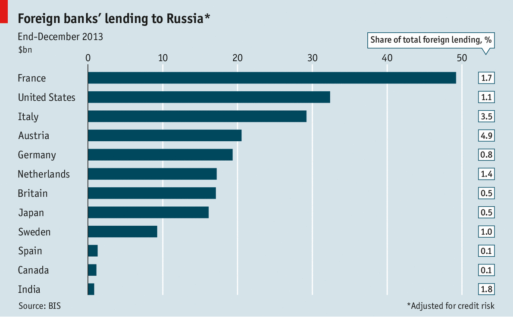
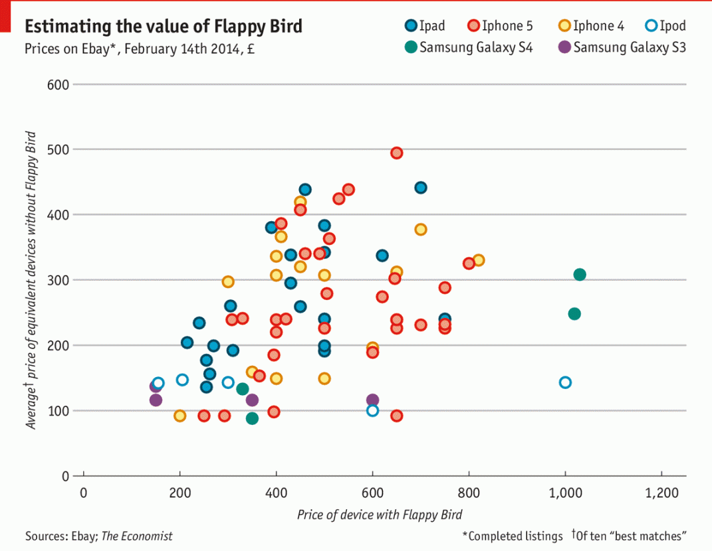
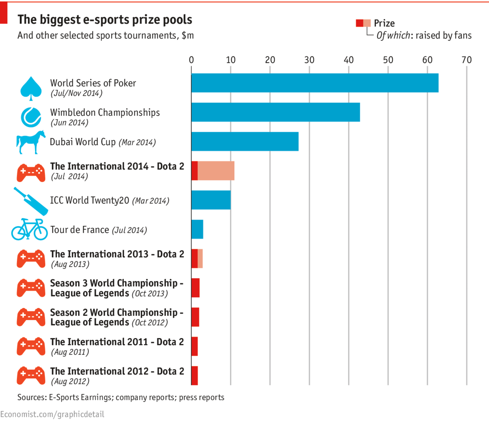
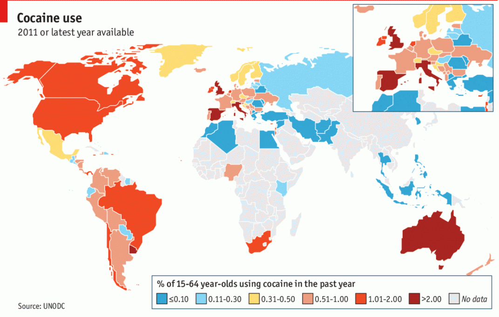
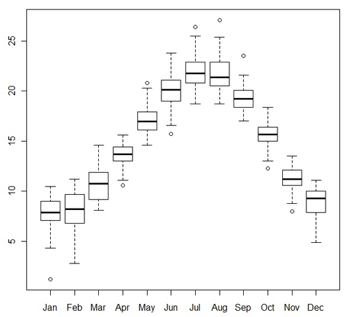
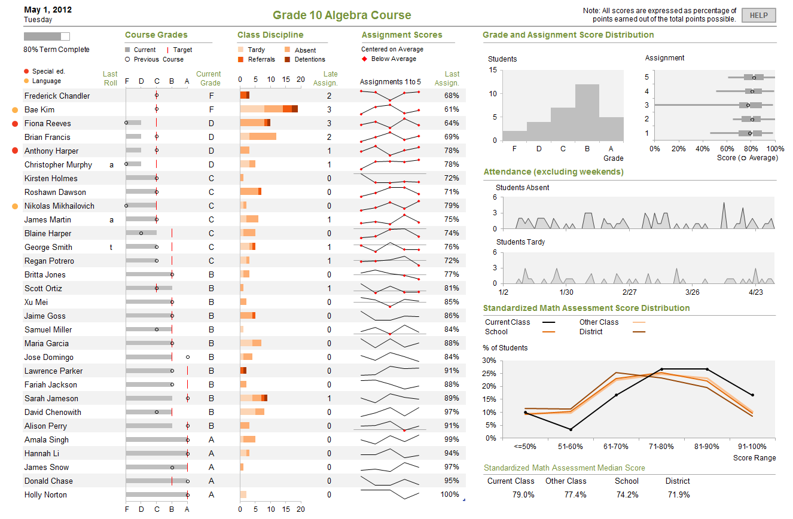
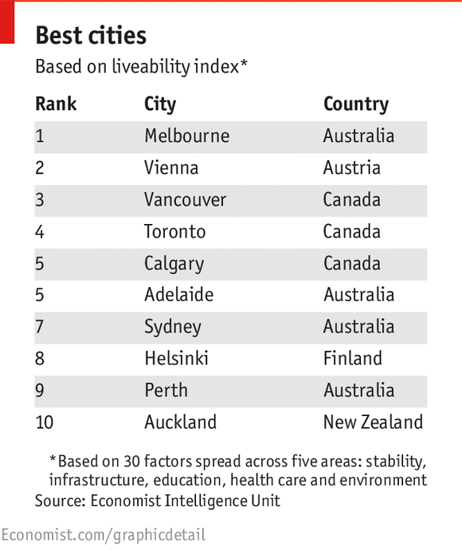

autoscale: true
footer: © leoluyi, 2018
slidenumbers: true

# [fit] 視覺化的語言心法

###   資料、模型、與溝通

#### 2018-03-31 leoluyi@iii

^
資料視覺化 (Data Visualization) 的一般使用者很少會用一些準則或理論去檢視它,但若對於訊息呈現上的流程與細節深入了解，在設計的速度以及達到溝通目的必然會順暢許多。視覺化背後的準則和原理揭示了很多包含資料與模型、知覺心理學、設計等專業的結合。本講題將從視覺化的語言出發，解析圖表的構成，讓實作者了解心法後能跳脫各種視覺化工具的框架，在應用情境中選擇並設計適合的視覺化流程。

---

## 關於我

- 呂奕 [Leo Lu](https://github.com/leoluyi)
- 台大工管
- 目前於金融業服務
- Build data products
    - ETL
    - Models
    - Text mining
    - Viz
    - ...

---

## 大部分人對視覺化的常見問題

- 對於（資料）視覺化想得太簡單或太難
- 覺得視覺化需要天生的設計美感？
- 好的視覺化是不是主觀的？
- 想實做自己的視覺化流程，但不知道如何開展，老是做到一半放棄
- 用 Excel 辛苦做出的圖表，卻無法在下次重複使用
- 導入視覺化工具，卻變成「純試試」，一點都不實用，造成導入的軟體無法發揮其效用

[.build-lists: true]

---

> 目的決定手段的好壞

---

# [fit] Why do we create data viz?

---

## Purposes of Viz

- Communicate
    - 報告給老闆、同事......
    - 讓相關的人做決策
- ...

---

### What I often do:  **Data Analysis (EDA)**

---

### Outlines

- The language of data viz (20 min)
- Viz the model by example (20 min)
- Summary and Recap (5 min)

---

### [fit] 今天從**心法**開始談

### The language of data viz

---

常常我們學到的：

1. 「一張好的圖可以勝過千言萬語」
    > 所以我要怎麼做？
2. XX 圖可以用 YY 方法做
    > 我怎麼知道要畫 XX 圖？

---

## [fit] 資料視覺化，重點在「**資料**」

---

`Tidyverse` -- Hadley Wickham

---

# [fit] 資料視覺化的心法

---

## 圖表如何從無到有？

1. **Issues**: 這張圖表想解決的*問題是什麼*？
2. **Geoms**: 要畫*什麼樣的圖*？
    - bar chart, line chart, heat map, ...
3. **Variables**: 需要那些變數？
    - 我的資料有這些變數嗎？
4. **Aesthetic Mapping**
5. **Layers**
6. **Stackinf**

---

在 Grammar of Graphics 裡面最重要的概念就是

# [fit] *Aesthetic Mapping*

---

## 最簡單的例子 🌰

[.build-lists: true]

Bar Chart

- Geom: Bar
- x: Percentage
- y: Foreign countries

---

## 例子1 🌰🌰

[.build-lists: true]

- Geom: Point
- x: Price
- y: Avg price without flappy bird

---

## 例子2 🌰🌰

[.build-lists: true]

- Geom: Bar
- x: Prize pool
- y: e-sports
- fill color: Raised by fan / not fan

---

## 例子3 🌰🌰🌰🌰

[.build-lists: true]

地圖

- Geom: Map raster
- raster: Countries
- fill color: Percentage 

---

## 例子4 🌰🌰🌰

[.build-lists: true]

Boxplot -- John W. Tukey 

- Statistical purpose
- Geom: boxplot
- x: ...
- y: ...
- 1st quantile
- median
- 3rd quantile

---

# 例子5 🌰🌰🌰

Stephen Few -- Dashboard

- Geom: too many
- Grid
- ...

---

## 例子6 🌰

[.build-lists: true]

表格??

- Geom: 表格
- x: Variables
- y: Records

---

# [fit] 視覺化心法的語言實現

###   R 的 ggplot2 實做

---
## ggplot2 in R

- **ggplot2** 是一個很強大的資料探索及視覺化工具，是最有影響力的 R 套件開發者 **Hadley Wickham** 所開發
- 所有繪圖函數都有背後的**視覺化邏輯（Grammar of Graphics）**

---

**Grammar of Graphics** 的作用就是幫助我們:

- 將圖表拆解成**個別元素**
- 將這些元素按照邏輯**個別操作**
- 正確又簡單地達到圖表的**目的**

---

## Live Demo

---

# Visualise the model

---

> Viz is fundamentally a human activity.

^
- 缺點：有些電腦自動畫的圖你根本看不懂 -> 因為沒有人腦
- 需要人腦 -> 無法 scale good viz

---

## Model + Viz == Good Business

- We cannot scale good viz
- But **Modeling** can!

> 把你 (複雜的) 想法塞到別人腦中

^
- Model 有先天的假設 -> 假設無法打破 -> 無法帶來 surprise
- 因此跟 viz 是互補的
- Viz 同時也是很好的溝通工具

---

---

## Live Demo Again

---

## Summary

[.build-lists: true]

- From data, to model, to viz
- Learn a viz language with its **tools**
- Play with your data

